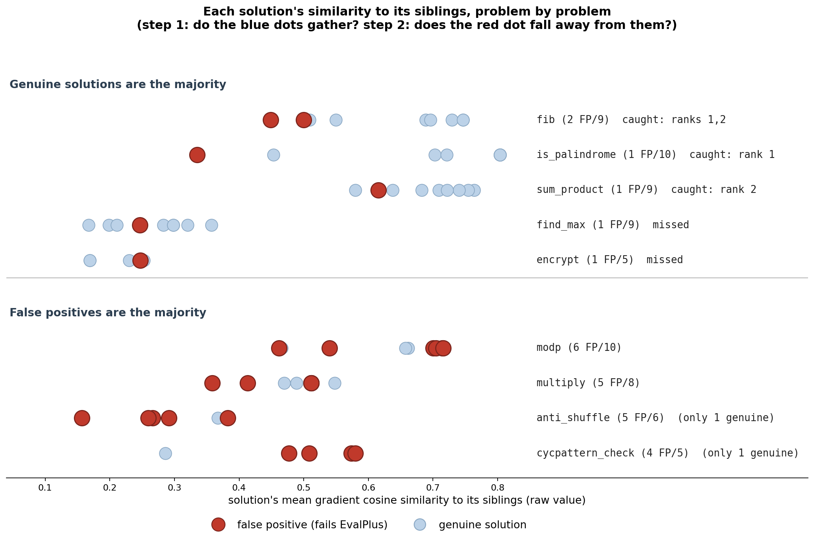
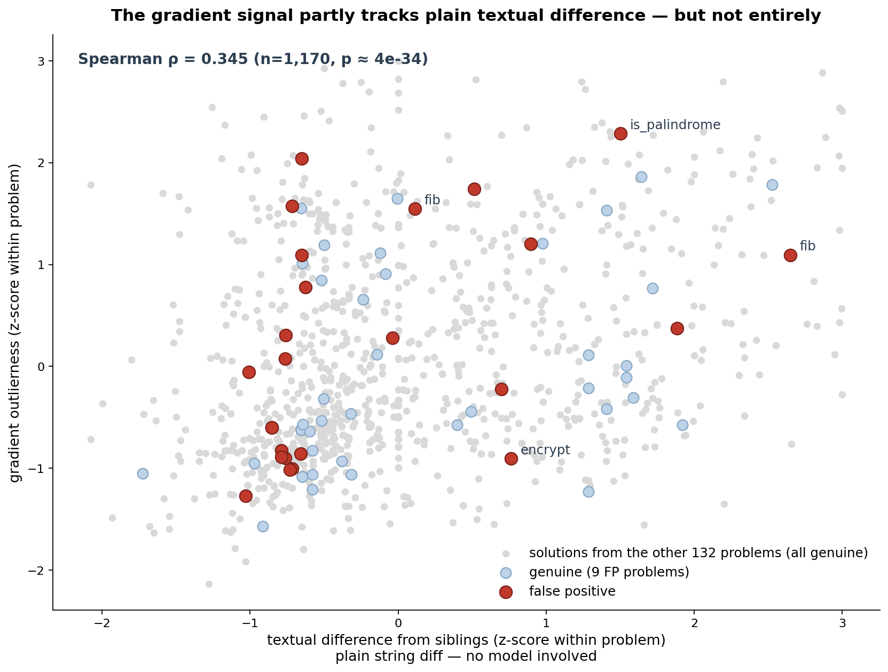
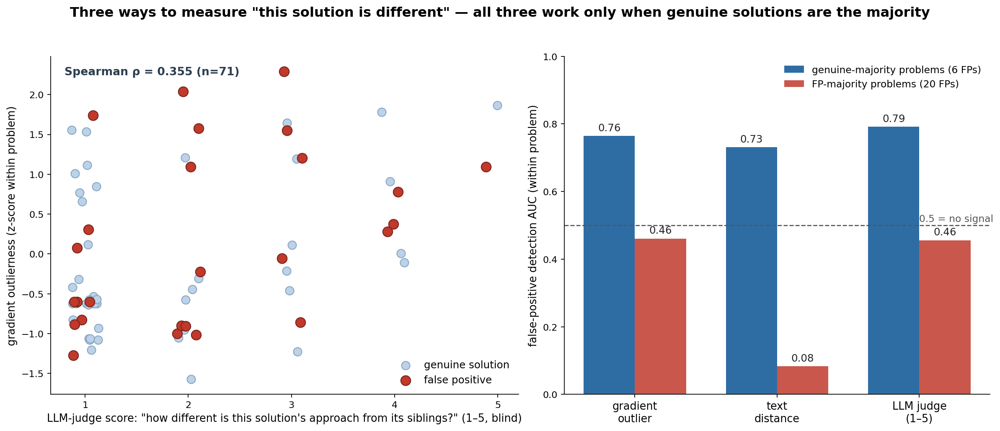

# Deep-dive analysis

Supplementary analysis behind the article. Everything here is reproducible from `results/` via the scripts referenced in each section. Headline numbers are in the [README](README.md).

## 1. Problem-by-problem walkthrough (the 9 mixed problems)

"Rank" = sort a problem's passing solutions by their average gradient cosine similarity to siblings, lowest first; rank 1 = furthest out.

### Regime 1 — genuine solutions are the majority (5 problems, 6 FPs, gradient AUC 0.764, CI 0.53–1.00)

- **`fib` (2 FP / 9) — caught, ranks 1 and 2.** Seven genuine solutions are all iterative (`a, b = b, a+b`). The two FPs are the only recursive solutions (`return fib(n-1)+fib(n-2)`) — correct output, exponential time, time out on large inputs. P(both land in the top 2 by chance) ≈ 3%.
- **`is_palindrome` (1 FP / 10) — caught, rank 1.** Nine genuine solutions compare the string to its reverse. The FP alone adds case normalization + punctuation stripping (over-reading the everyday meaning of "palindrome"; the spec compares as-is). Notably, this FP was caught **only by the gradient** — both the text-distance ruler (rank 3) and the LLM judge (score 3, while two genuines got 4) missed it.
- **`sum_product` (1 FP / 9) — caught, rank 2 — with a lesson about rank 1.** Seven genuines share one template (early return on empty list, `sum()` builtin, multiplication loop). The FP is a local mutation of that template (conditional initialization + a slice loop; crashes on an empty-dict input). **Rank 1 is a genuine solution** — the only one that skips `sum()` and accumulates sum and product in a single loop. Perfectly correct, just stylistically unique. *Different is not wrong:* the top flag can land on an innocent stylistic variant; the score nominates candidates, it doesn't issue verdicts.
- **`find_max` (1 FP / 9) — missed, rank 4.** All solutions share the same loop algorithm; the FP differs by one comparison (`len(max_word)` instead of the tracked unique-character count). Two compounding reasons it's invisible: the bug is a single expression, **and** this problem is the 3rd loosest of all 141 (helper-function and style choices scatter the gradients), so the reference crowd is weak. The two causes can't be separated here.
- **`encrypt` (1 FP / 5) — missed, rank 4.** The FP is a one-line comprehension (wrong: skips uppercase/digit handling). But this problem's four genuine solutions already share nothing — a loop with isalpha checks, alphabet-string indexing, a nested helper. It is the loosest problem of all 141 (cohesion 0.21). With no crowd, "far from the crowd" is undefined.

### Regime 2 — false positives are the majority (4 problems, 20 FPs, gradient AUC 0.461)

`modp` 6/10, `multiply` 5/8, `anti_shuffle` 5/6, `cycpattern_check` 4/5. The outlier premise (a sound majority) is broken. In `cycpattern_check`, the rank-1 outlier is the single *genuine* solution; in `anti_shuffle`, the genuine one hides mid-pack (rank 5/6) — either way, "outlier = FP" stops meaning anything. `modp` and `multiply` are also single-expression bugs, so their non-detection is confounded between "bug too small" and "majority broken."

### The 7 all-FP problems

`filter_integers` 10/10, `prime_fib` 6/6, `valid_date` 5/5, `is_simple_power` 2/2, `vowels_count` 1/1, `is_multiply_prime` 1/1, `is_bored` 1/1. No genuine solutions → no within-problem comparison at all. Together with regime 2: **46 of 52 FPs (88%) live where the wrong solutions are the majority or the entirety of the passing pool.**

## 2. Three rulers, one pattern

We measured "how different is this solution from its siblings" three ways (`scripts/textdist_analysis.py`, `scripts/judge_run.py`):

1. **Gradient outlierness** — mean cosine similarity of per-solution gradients (fixed random LoRA), within problem.
2. **Text distance** — mean normalized edit distance (1 − `difflib.SequenceMatcher.ratio`) to siblings, docstrings/comments stripped. Model-free.
3. **Blind LLM judge** — Azure OpenAI GPT (deployment `gpt-54-mini`), shown each problem's solutions with labels hidden and order shuffled (seed 42), scoring approach-difference 1–5 (correctness never mentioned).

| FP-detection AUC (within problem) | genuine majority (6 FPs) | FP majority (20 FPs) | pooled (26 FPs) |
|---|---|---|---|
| gradient outlier | 0.764 | 0.461 | 0.569 |
| text distance | 0.731 | 0.083 (inverted) | 0.329 |
| LLM judge | 0.792 | 0.456 | 0.640 |

Correlations: Spearman(gradient, text) = 0.345 (n=1,170); Spearman(gradient, judge) = 0.355; Spearman(judge, text) = 0.418.

Per-case agreement across rulers (regime 1):

| FP | gradient rank | text rank | judge score |
|---|---|---|---|
| `fib` (2 recursive) | 1·2 /9 | 1·3 | 5·3 (every genuine got 1) |
| `is_palindrome` | **1**/10 | 3 | 3 (two genuines got 4) |
| `sum_product` | 2/9 | 2 | 3 |
| `find_max` | 4/9 | 7 | 1 ("same approach") |
| `encrypt` | 4/5 | 2 | 2 |

All three rulers agree on `fib` (caught) and on `find_max`/`encrypt` (ordinary). `is_palindrome` is the one case where the gradient saw something the other two didn't.

## 3. Effect size d (post-hoc separability)

A single number combining "how far from the crowd" with "how tight the crowd is":

> d = (mean similarity of genuine solutions − FP's similarity) / std of genuine similarities

d measures **separability** — whether the score alone can tell the FP apart from the genuines — not "how alone" a solution is. A solution can be far from everything (low absolute similarity) yet inseparable, if the genuines are equally far from each other.

| problem | genuine mean ± std | FP's d | outcome |
|---|---|---|---|
| `is_palindrome` | 0.744 ± 0.110 | +3.73 | caught |
| `fib` | 0.667 ± 0.090 | +1.85, +2.43 | caught |
| `sum_product` | 0.699 ± 0.059 | +1.41 | caught |
| `find_max` | 0.267 ± 0.062 | +0.33 | missed (inside genuine spread) |
| `encrypt` | 0.205 ± 0.037 | **−1.14** | missed (closer to center than the average genuine) |

Caveats: d requires labels (analysis only, not detection); the genuine std is estimated from 4–9 solutions, so d is fragile (`multiply`'s d ≈ +4.3 rests on 3 genuines with std 0.033 — not citable). Values in `results/ep_effectsize.json`.

## 4. Cohesion (no labels needed)

Cohesion = a problem's mean pairwise gradient similarity among its solutions. It can be computed without labels, so it tells you *in advance* whether outlier detection is even applicable to a problem — in one direction only: low cohesion (no crowd) → not applicable. High cohesion does **not** mean safe: an all-FP problem like `filter_integers` (10 identical `isinstance` solutions) is highly cohesive and wrong throughout.

Regime-1 cohesion, ranked among all 141 problems (1 = loosest): `encrypt` #1 (0.21), `find_max` #3 (0.26), `fib` #79 (0.62), `sum_product` #102 (0.69), `is_palindrome` #105 (0.70).

## 5. Task level

For the all-FP problems, within-problem comparison is impossible — but the task as a whole can be compared against other tasks (the NYU paper's unit). `scripts/task_level.py`: average each problem's solution gradients into one task vector, normalize, measure each task's mean cosine similarity to all other tasks.

Result (suggestive, not conclusive): tasks with few passing solutions become outliers from noise alone (Spearman(n, sim) = 0.19), so restricting to the 131 tasks with ≥5 passing solutions, the 3 all-FP tasks rank 20th (`valid_date`), 27th (`prime_fib`), 40th (`filter_integers`) most-outlier — top 15–30%, AUC 0.789 on 3 positives. The 4 FP-majority mixed tasks don't stand out at all (`multiply` ranks 144/154 — among the most typical). The NYU paper averages ~1,000 rollouts per task; we have 5–10. A proper task-level test needs that scale. Values in `results/ep_task_sims.json`.

## 6. Visualization notes

We tried four versions of the main figure: a rank strip (drops magnitude information), the raw-similarity strip above, the strip with a "genuine crowd band" (misleading for loose problems — scattered solutions are not a band), and per-problem 2-D MDS maps of the pairwise cosine distances (in 1.8M dimensions, distances compress; even a clearly-separable FP doesn't visually pop in 2-D with 5–10 points). The raw strip plus the two-step reading rule (does a crowd exist → does the red dot leave it) carried the most information honestly.
